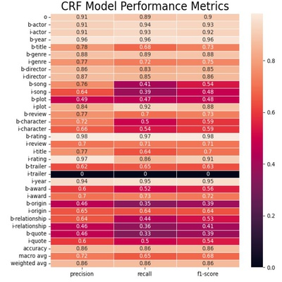
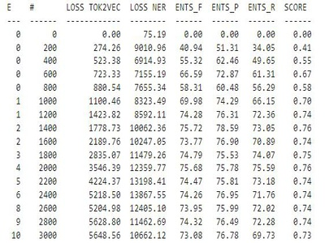
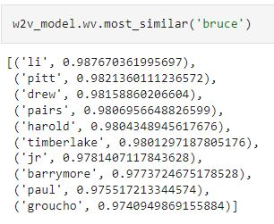
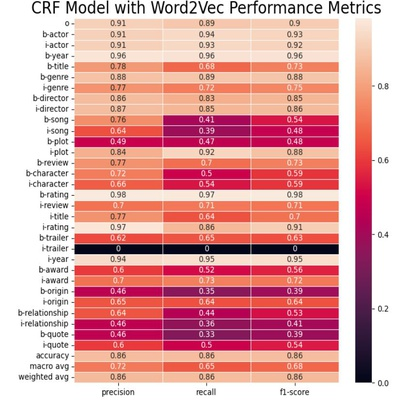
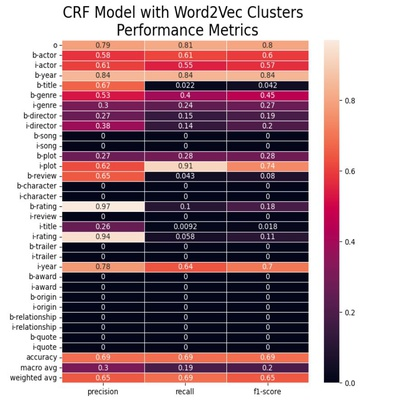
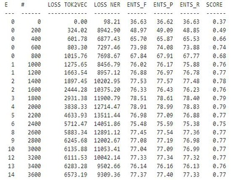

# Training Custom Named Entity Recognition Models

## Identifying Entities of interest in Movie Trivia Questions
## By: Barker French
 
 

## 1. Introduction

"Over 2.5 quintillion bytes of data are generated every day.  80% of it is unstructured" (Vasilis, 2022), and we, humans, can't 
consume and classify all of this data on our own.  However, with the help of computers, humans can hope to make sense of this data.
One method that can help to structure the data is named entity recognition (NER).  NER — sometimes referred to as entity 
chunking, extraction, or identification — is the task of identifying and categorizing key information (entities) in text (Marshall, 2019).  
These tags can then be used to order and classify data so that it can be retreived when needed. 

While many off the shelf NER models exist, these models classify text into general categories that can be relevant across many types of data. For example, spaCy's standard NER model includes the general categories of "person", "organization", "date", etc. While this text classification capability is powerful, it leaves gaps for important, specific business use cases in the law, medicine, customer relations, etc. These specific business use cases require a more specialized NER tool capable
of identifying entities of interest in each of the respective fields. 

This project centers on the the creation of a specialized NER model--based on conditional random fields (CRF)--that can identify entities of interest in movie trivia questions.  Though the focus of the project's model is movie trivia, the same techniques can be used to train NER models for application in law, medicine, customer relations, etc.  After created and trained, the custom model's performance was compared against spaCy's pre-trained, mainstream NER model that was further trained on movie trivia question data. Please note that the custom NER tool built was heavily based on a custom NER discussed in Text Analytics with Python by Dipanjan Sarkar.

## 2. Research Questions

To focus the research, training, and building of the custom NER model, the following questions were posed.  At what performance level can a custom NER model built on a CRF be trained to work on specific data sets?  How well can spaCy's professionally built, generic NER model be trained on the movie trivia data set, and how does spaCy's model perform compared to the custom CRF-based named entity recognition model?  Since the performance of both of these models depends in part on how they are trained, what kinds of techniques can be used to improve their performance?  

## 3. Related Work

There is a large body of existing work investigating the application and the improvement of CRF models that address the problem of NER.  Tran et al. (2017) developed "a method that combines active learning and self-learning to reduce the labeling effort for the named entity recognition task from tweet streams by using both machine-labeled and manually-labeled data...[showing] it can significantly improve the performance of the [CRF] systems (Tran et al., 2017, p. 1)."  VeeraSekharReddy et al. (2022) found that when a "CRF classifier is integrated into an active learning-trained hybrid model...it can shorten the time it takes for the model to converge and cut down on the labor intensive cost of traditional approaches (VerraSekharReddy, 2022)."  And, Liu et al "proposed a novel NER system for tweets, which combines a KNN classifier with a CRF labeler under a semi-supervised learning framework...[showing] the effectiveness of [their] method (Lui 2011)."  As will become clear, Liu's worked inspired one of this project's attempts to improve the CRF model's performance.

## 4. Dataset

The data used to train both the spaCy and the custom CRF NER model is a combination of two datasets--eng.bio and trivia.bio--that are a part of the Spoken Language Systems (SLS) project in MIT's Computer Science and Artificial Intelligence Laboratory.  Each dataset includes a list of movie trivia questions and an entity tag.  In training the models, a supervised learning task, the dependent target variable is the NER tag while the words in the trivia questions form the basis for the independent variable features.  Read on for more information on the dataset

**Eng Dataset**

eng.bio is a 1.9mb dataset that consists of 12,218 simple movie questions over 124,177 rows, with one word and one ner label per row. Each row in the dataset consists of an IOB2 tag (more on IOB2 below) and a word from a specific movie trivia question.  The boundary of each move trivia question in the file is identified by a blank return line appearing between the previous and subsequent questions.  The following target variable movie entities are identified in the eng.bio data: 'OTHER', 'ACTOR', 'YEAR', 'TITLE', 'GENRE', 'DIRECTOR', 'SONG', 'PLOT', 'REVIEW', 'CHARACTER', 'RATING', 'RATINGS_AVERAGE', 'TRAILER'.
 

**Trivia Dataset**

The second dataset, called trivia.bio, is 3.0mb, and consists of 9,769 complex movie questions over 197,858 rows. Each row in the dataset consists of an IOB2 tag (more on IOB2 below) and a word from a specific movie trivia question.  The boundary of each movie trivia question is identified by a blank return line appearing between the previous and subsequent questions.  The following target variable movie entities are identified in the trivia.bio data: 'Actor', 'Outside', 'Plot', 'Opinion', 'Award', 'Year', 'Genre', 'Origin', 'Director', 'Soundtrack', 'Relationship','Character_Name', 'Quote'.
 

**IOB2 Format**

IOB2 (Inside, Outside, Beginning) format "is a common tagging format for tagging tokens in a chunking task in computational linguistics... The I- prefix before a tag indicates that the tag is inside a chunk.  An O tag indicates that the token belongs to no chunk...The B-tag is used in the beginning of every chunk (Wikipedia 2022).  Each dataset has two columns: an IOB2 tag and the word that is being tagged.

 

The below table describes the specific target variables and shows the relationship between entities in the two datasets.

|eng variable            |trivia variable  |description                      |
| ---------------------- | -----------| ---                                  |
|outside                 | outside    | untracked entity                     |
|actor                   |  actor     | person's name acting in the movie    |
|year                    |year      | two and four digit years            |      
| genre                  | genre      | movie's subject matter               |
| director               | director   | person's name in charge of movie     |
| song                   | soundtrack | song's in a movie                    |
| plot                   | plot       | movie's story line                   |
| review, ratings_average| opinion    | words describing the movie           |
| character              | character_name| person's name in movie story line |
| rating                 | na         | classification of movie appropriateness for different age groups
| title                  | na         | movie name
| trailer                | na         | identfies a word as preview or trailer|
| na                     | award      | recognition for acheivement in a given category
| na                     | origin     | source of inspiration for movie script |
| na                     | relationship| how movie is related to other movies in the same story line|
|

 

The data can be found here:

https://groups.csail.mit.edu/sls/downloads/movie/

## 5. Exploratory Data Analysis

Consisting of words and IOB2 labels, the data set appeared relatively straight-forward.  However, the owners of the data did not provide basic descriptive information about the data.  To better understand the dataset, the data were merged into a single set, additional columns were added to track question number, original dataset source, and the IOB2 label was divided into it's bio label and it's entity label.  Exploratory data analysis was conducted.

In the "LOB2_Label_count" table, the data were aggregated by iob2_label to determine how many IOB2 entities existed in the data.  The resulting table, "IOB2_Label Count" highlighted that a particular movie entity could have multiple IOB2_Label components.  For example, the ACTOR tag appears twice, once as B-ACTOR--the first descriptor of an actor;s name--and again as I-ACTOR--the descriptor of any additional names associated with the actor (e.g. I-ACTOR Cher, or I-ACTOR Harrison B-ACTOR Ford, or b-ACTOR Daniel I-ACTOR Day I-ACTOR Lewis) .  To quantify the number of instances of each entity in the data, multi-word entities were combined into single strings, and then displayed in a bar graph called the "Move Entity Count - Combined Data Set.

To confirm that the resulting, merged entities were meaninful, a sample of the merged entities was then displayed to confirm the meaningfulness of the combined entry.

## 6. Pre-Processing

Neither the CRF nor spaCy NER models used the same data format as was provided by the movie trivia data source.  Preprocessing was required to match the model's required data format and, for the CRF model, feature engineering was then conducted on the training data.  SpaCy's input data neither required nor allowed enrichmetn of the training data.

### CRF Pre-Processing

To prepare the data for the CRF model, the data was converted into a list of sentences where each sentence was itself a list of tuples containing one word from the sentence, that word's POS tag, and that word's IOB2 tag.  

       

Once in the list of sentences format, the data underwent feature engineering.  The following features were created for each word. 

 
| Feature          | Feature Description                                                |
| -----------------|----------------------------------------------                      |
| bias             | the bias for the model                                             |
| word.lower       | the lower case form of the word                                    |
| word[-3:]        | the last 3 letters fo the word                                     |
| word[-2:]        | the last 2 letters fo the word                                     |
| word.isupper     | boolean value - true if word is upper case else false              |
| word.istitle     | boolean value - true if word is title else false                   |
| word.isdigit     | boolean value - true if word is digit else false                   |
| postag           | part of speech tag                                                 |
| postag[:2]       | first two characters in the part of speech tag                     |
| BOS              | boolean value - tests if a word is the beginning of the sentence   |
| -1: word.lower   | prior word - lower case form                                       |
| -1: word.istitle | prior word - boolean value - true if word is title else false      |
| -1: word.isupper | prior word - boolean value - true if word is upper case else false |
| -1: postag       | prior word - part of speech tag                                    |
| -1: postag[:2]   | prior word - first two characters in the part of speech tag        |
| +1: word.lower   | next word - lower case form                                        |
| +1: word.istitle | next word - boolean value - true if word is title else false       |
| +1: word.isupper | next word - boolean value - true if word is upper case else false  |
| +1: postag       | next word - part of speech tag                                     |
| +1: postag[:2]   | next word - first two characters in the part of speech tag         |

As a part of the feature creation the list of sentences was converted into to one list of dictionaries, where each dictionary contained the feature enrichment of one word.  In this new format, there was no distinction between the ending of one sentence and the beginning of the next sentence.  Finally the data were split into a training and a test set in prepration for training the CRF model. 

  
### SpaCy Pre-Processing

SpaCy's NER model requires a completely different format for model training.  The spaCy model requires that the movie trivia questions be configured as a list of 2 element tuples, where each tuple contains the movie trivia question as a string and a dictionary with one key called entities and value that is a list of 3 element tuples, where the first two elements are integers representing the location of an entity in the sentence string and the last element is a the IOB2_label.
 
 
  

           
  
## 7. Models

  
### CRF Model
  
As previously noted, the CRF NER model implemented is based on a model identified by Dipanjan Sarkar in his book "Text Analytics with Python".  As Sarkar explains "the key point to remember ... is that NER is a sequence modeling problem at its core.  It is more related to the classification suite of problems, wherein we need a labeled dataset to train a classifier (Sarkar, 2019).  Hidayatullah further explains that "in sequential text tagging, the CRF treats text data as a linear chain, a basic network with nodes between adjacent words....the CRF [model] predicts the [IOB2] tag Y based on the input [movie question] X by reprsenting a probabilty distribution p(y|x) (Hidayatullah, 2022).

 
 
To implement the CRF model, the sklearn-crfsuite library was used in conjuction with sklearn's GridSearchCV library.  The sklearn CRF model has several parameters, including L1 and L2 regularization constraints and an upper bound on the maximum number of iterations.  Regularization is used to reduce the potential overfitting or underfitting of a model on its training data.  The sklearn GridSearchCV library was used to search for the optimal regularization constraints and to implement Cross Validation.  Cross validation is a method that trains and evaluates machine learning models on subsets of the training data.  Cross validation further works to mitigate the potential for model overfitting on training data.  The weighted f1-score was used by the grid search tool to identify the best model.  F1-score is the harmonic mean of a classification model's precision and recall scores.  The results from the best model were a weighted average precision, recall, and f1-score of 0.86 out of 1. 

 
 
### SpaCy Model
 
The second NER model implemented was spaCy's proprietary NER model.  There is not a great deal of available information on the spaCy model.  SpaCy describes it's model as "A transition-based named entity recognition component.  The entity recognizer identifies non-overlapping labelled spans of tokens.  The transition-based algorithm used encodes certain assumptions that are effective for "traditional" named entity recognition" (Entity Recognizer, 2023).  Looking at the parameters of the model, it is clear that spaCy is using a neural network of some sort. 

 
 
SpaCy's model is more complex than the sklearn's CRF model because it contains multiple neural networks that handle various steps in the classification process. The training was conducted with spaCy's default values: spaCy's TransitionBasedParser.v2, a batch size of 1000, Adam optimizer, etc.  The resulting weighted F1-score of 0.73 was not quite as a good as the CRF model.  
 
  
 
 ## Model Improvement
 
After successfully training the NER models and generating a base level of results.  Attempts were made to improve each model's performance. 
 
### CRF Model
 To find methods of improving performance, academic journal articles were reviewed.  The most notable method for improving CRF model performance was increasing the amount of labeled training data.  As Tran el al. noted in their 2017 paper, "NER methods use supervised learning, requiring a large amount of training data with high accuracy (Tran 2017).  Researchers were still making the same observation five years later.  VeeraSekhar et al found that "like other supervised models, [CRF] needs a large amount of training data (VeeraSekhar et al., 2022).  However, given the time involved in creating labeled training data, this project focused instead on feature engineering.  
  
  The first attempt to improve the model through feature engineering was modeled on Poddar et al's 2020 paper.  Poddar proposed "the use of Word2vec model context words [to help] predict the target word easily, and found that "with the use of Word2vec, we have produced a good result for Named Entity Recognition. (Poddar etal 2020).  With this example in mind, Gensim's word2vec model was implemented on each word in the training data.  
  
  As a test of the meaninfulness of the Word2vec vectors, the Word2vec function "most similar" was used on actor bruce willis's first name.  The result was a list the most similar vectors in the model and 8 of 10 of these were actors' names suggesting that Word2vec vectors could be useful elements in the CRF feature vector.  Unfortunately, including the vectors as a feature did not affect the performance of the model.
  
  Word2vec Vector Similarity             |  CRF with Word2vec Feature Performance
:-------------------------:|:-------------------------:
    |  
  
  More research was conducted, which validated the lackluster effect of including Word2vec vectors in CRF feature vectors.  Sienčnik cited a report by "Banasal et al. (2014) that simply adding the relevant word vector to the feature vector during training does not yield improved results" (Sienčnik, 2015).  However, this research did provide a possible method for effectively incorporating clustered Word2vec vectors in the CRF feature vectors to improve performance.  Instead of merely including the word vector Siencnik suggested using Guo et al's idea of "clustering word vectors"  (Sienčnik, 2015).  With this finding in mind, the Word2vec vectors were clustered using kmeans clustering.  An attempt was made to identify the optimal number clusters usign the  silhoette score as the decision metric.  Unfortunately, the silhouete score started high and became progressively smaller with the number of clusters undertaken.  In contrast, an effective clustering search should have generated a series of valleys and peaks associated with various numbers of clusters.  The optimal number of clusters would have occurred at the highest peak.  With no clear peak identified,  this in mind, 50 clusters was selected and the model was retrained.  Again there was no improvement to the results.  
  
  

### spaCy Model
 Because the spaCy model only accepts sentence strings and entity tags as inputs, the opportunity to improve model performance is through it configuration file.  The configuration file contains a large number of parameters.  For the purposes of this project, several parameters were selected.  Additional feature attributes were added to spaCy's feature vectors, including the part of speech tag ("TAG") and the dependenchy tag ("DEP").  Additional layers were added to the MaxoutWindowEncoder.v2.  The number of layers in the TransitionBasedParser.v2 were increased from 64 to 96.  The highest performing model included all of the changes to the initial configuration file and resulted in a weighted F1 score of 0.77.

   
  
 ## Future Work
  
There are several obvious opportunties for future work all of which are related to the CRF Model.  First, Siencnik and Guo were both separately and independently able to use unsupervised clustering of words to improve the performance of their NER models.  In each case, the data used--Reuters English newswire from 1996 to 1997 for Siencnik and English Wikipedia through August 2012 for Guo-- were far larger than than the movie trivia data used in this project.  It is possible that more movie trivia data is needed to establish meaningful clusters.  A future experiment could seek out additional labelled movie data and make a second attempt at clustering.  It's possible that more instances would generate better results.

  
  
Second, as noted above, one of the best methods for improving the performance of supervised learning models is to acquire more labelled training data.  Unfortunately, creating labelled training data is time-intensive.  One of the interesting concepts that I read in several articles involves the creation of additional training data through self-learning and active learning models.  In active learning "instead of relying on the instances [selected for labelling] being selected randomly from a large corpus, the [Active Learning] method chooses significant instances to be labeled by an expert. (Tran V.C., 2017).  At the same time, a self-learning method is used where "a classifier is first trained with a small amount of labeled data.  The classifier is then used to classify the unlabeled data, [which] are added to the training data" (Tran V.C., 2017).  The result was that their proposed method "can significantly improve the performance of the classifer" (Tran V.C., 2017).  Similarly, VeeraSekharReddy B. et al. found that "For large amounts of annotated data, [active learning] can shorten the time it takes for the model to converge and cut down on the labor intensive cost of trdaditional approaches" (VeeraSekharReddy B. et al, 2022).

 
 
## Conclusion

 
In conclusion, the CRF NER model performed at the 0.86 weighted F1-score level, while the spaCy NER model performed at the 0.77 level.  The CRF model significanly out performed spaCy's model.  However, spaCy's configuration file reveals a complicated set of parameters, which if tuned properly, may hold the potential to outperform CRF model.  Similarly, the literature suggests that methods exist that can improve the CRF model's performance, including the clustering of Word2vec vectors.  So more work must be done to determine which model is in fact better.
 
 
      
## Sources

Entity Recognizer. (2023, April 18) . Retrieved from https://spacy.io/api/entityrecognizer

Hidayatullah, A. F., Apong R. A., Lai, D. T. C., and Qazi,  A., "Extracting Tourist Attraction Entities from Text using Conditional Random Fields," 2022 IEEE 7th International Conference on Information Technology and Digital Applications (ICITDA), Yogyakarta, Indonesia, 2022, pp. 1-6, doi: 10.1109/ICITDA55840.2022.9971310.
 
Liu, X., Zhang S., Wei F., Zhou M. (2011). Recognizing Named Entities in Tweets. Proceedings of the 49th Annual Meeting of the Association for Computational Linguistics: Human Language Technologies - Volume 1June 2011 Pages 359–367.

Poddar, K., Mehta, P., Gatty, V. (September 2020). Named Entity Recognition using Word2vec. International Research Journal of Engineering and Technology. - Volumne 07 Issue09 Pages 1818 - 1820.
  
Marshall, Christopher. (2019 December 18).  What is named entity recognition (NER) and how can I use it?.
Medium. https://medium.com/mysuperai/what-is-named-entity-recognition-ner-and-how-can-i-use-it-2b68cf6f545d

Sarkar, Dipanjan. 2019. Text Analytics with Python. Apress.
 
Sienčnik, Scharolta Katharina. 2015. Adapting word2vec to Named Entity Recognition. In Proceedings of the 20th Nordic Conference of Computational Linguistics (NODALIDA 2015), pages 239–243, Vilnius, Lithuania. Linköping University Electronic Press, Sweden.

Tran, V.C., Nguyen N.T., Fujita H., Hoang, D.T. (2017). A combination of active learning and self-learn for named entity recognition
on Twitter using conditional random fields. Elsevier, 132, 179-187.

Vasilis, Theo. (2022 February 9). When Data Gets Too Big Why You Need Structured Data. apify.
https://blog.apify.com/when-data-gets-too-big-why-you-need-structured-data/

VeeraSekharReddy B., Rao, K. S., and Koppula, N., "Named Entity Recognition using CRF with Active Learning Algorithm in English Texts," 2022 6th International Conference on Electronics, Communication and Aerospace Technology, Coimbatore, India, 2022, pp. 1041-1044, doi: 10.1109/ICECA55336.2022.10009592.

Wikipedia. (2022, December 13). Inside-outside-beginning(tagging). https://owl.purdue.edu/owl/research_and_citation/apa_style/apa_formatting_and_style_guide/reference_list_electronic_sources.html 

